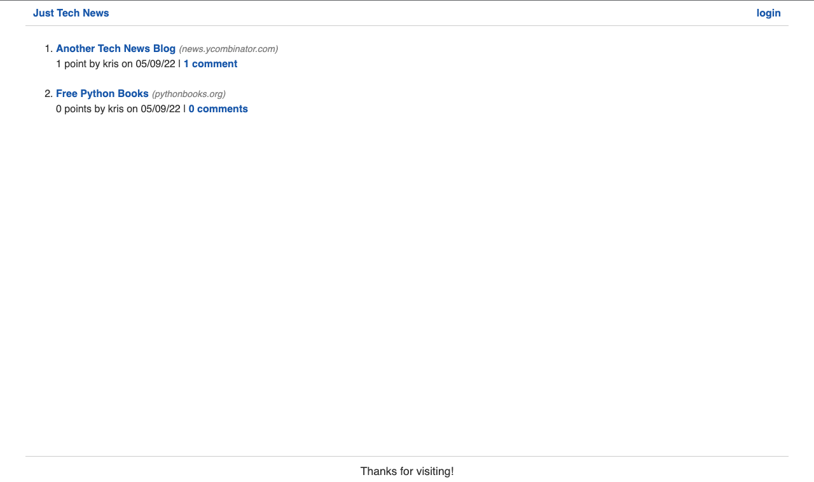
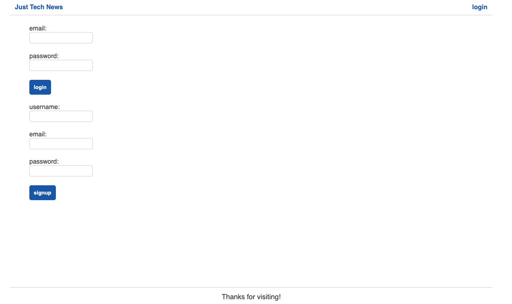
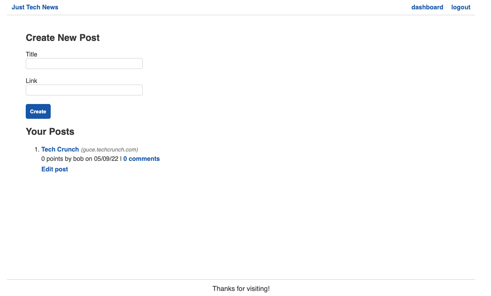
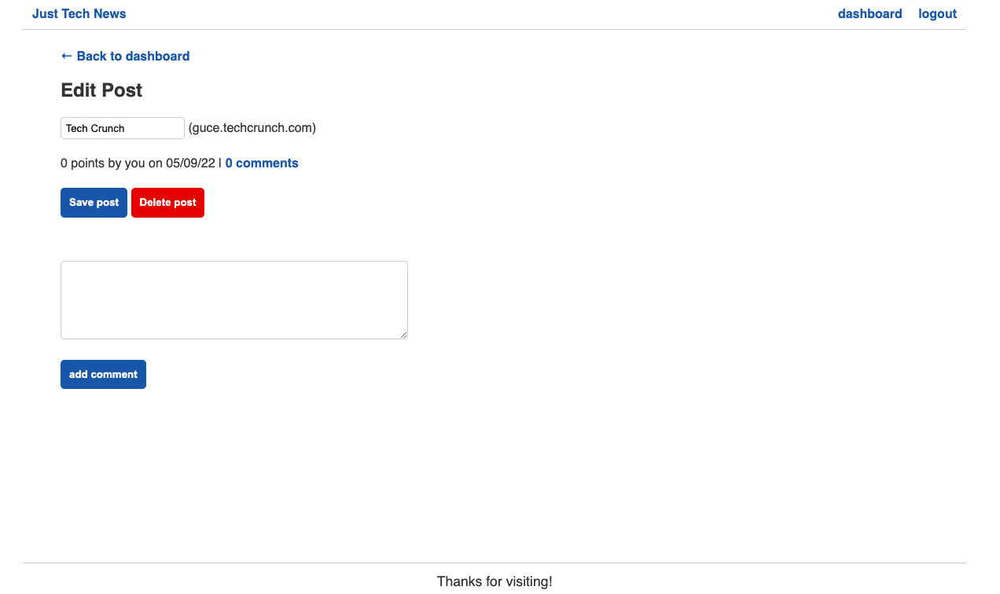
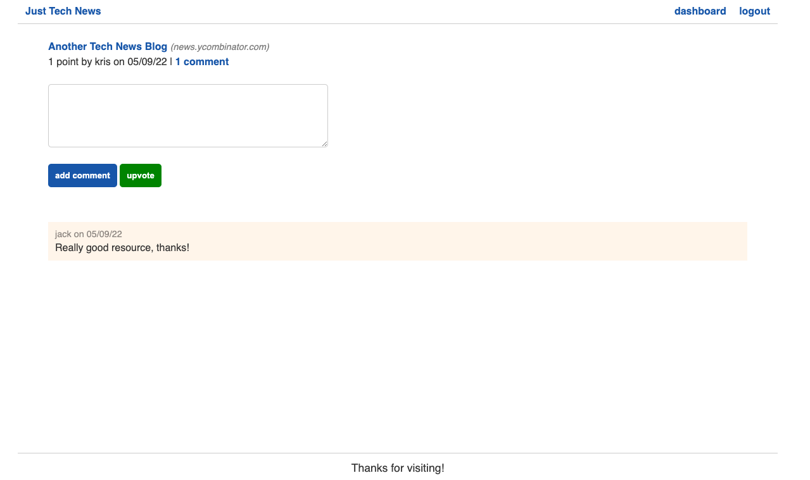

# Tech News Python API

## Description

In this project I have created a full-stack web application for a tech news board using the Flask Python framework to create RESTful API routes and Jinja templates to create reusable front-end templates.

## What I have done

- [x] Set up a virtual environment to run the app locally using the venv module
- [x] Defined functions and classes using Python syntax
- [x] Used the Flask library to create GET, POST, PUT and DELETE routes
- [x] Created MySQL tables using the SQLAlchemy ORM
- [x] Queried the database using SQLAlchemy methods
- [x] Handled errors using `assert` and `try ... except` statements
- [x] Used the contextual `g` and `session` objects of Flask across routes
- [x] Imported custom filter functions into Jinja templates
- [x] Created a custom decorator function for route protection

## Getting started

Run the following command to start the virtual environment when running the app locally:

Windows users
`.\venv\Scripts\activate`

macOS users
`. venv/bin/activate`

Start the Flask server with the following command:
`python -m flask run` or `python3 -m flask run`

## Contributing

Submit a pull request

## Link to GitHub repository

https://github.com/ivnkris/python-newsfeed

## Link to deployed application

https://python-tech-news-blog.herokuapp.com/

## Screenshots

## Questions

- Send any questions via my [GitHub profile](https://github.com/ivnkris)
